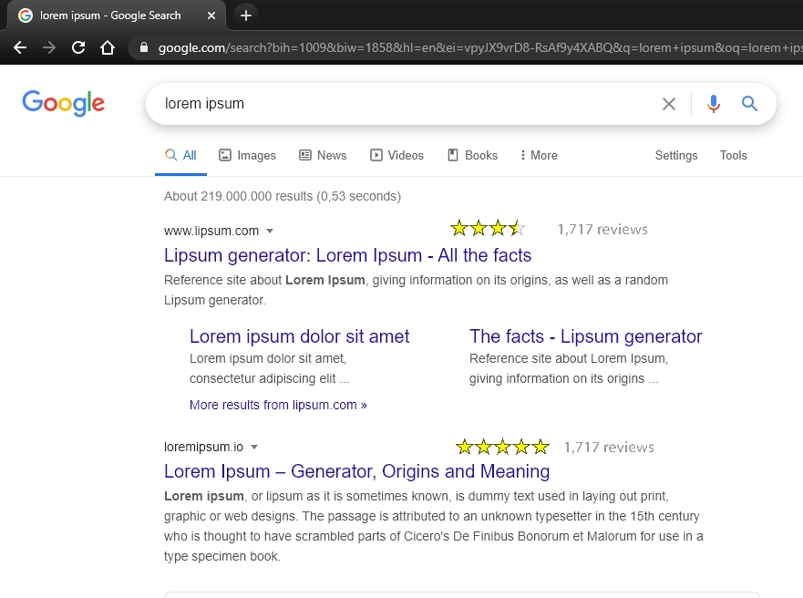

# rated urls

### description:

user rates urls, ratings show on search results

- ## some url

  5 stars sits in the (lower) corner of browser
  
  user can choose using 1-5 stars, (rating and url are sent to db)
  -> gets a feedback (green check mark)

- ## search results
  user does a google search (urls in the results rendered are checked with the db -> results that have been rated before renders ratings
  
