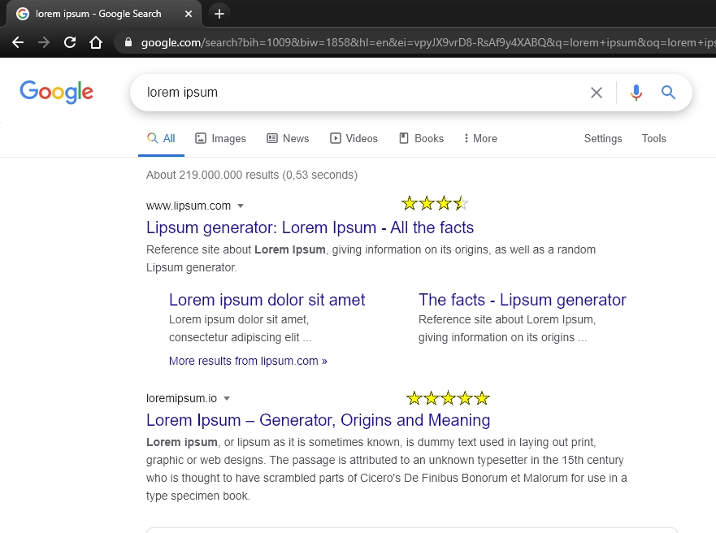
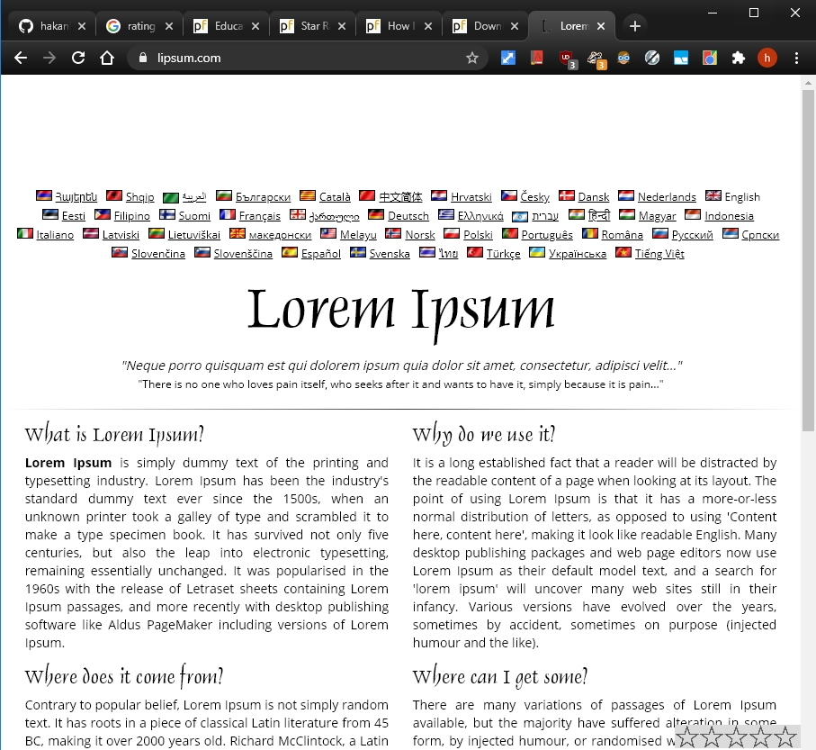

# rated_url

user rates urls, ratings show on search results

- 5 stars sits in the (lower) corner of browser
  html
- user can choose using 1-5 stars,
  rating and url are sent to db
- gets a feedback (green check mark)
  html

- user does a google search
  urls of the results rendered are checked with db
- results that have been rated before renders ratings

